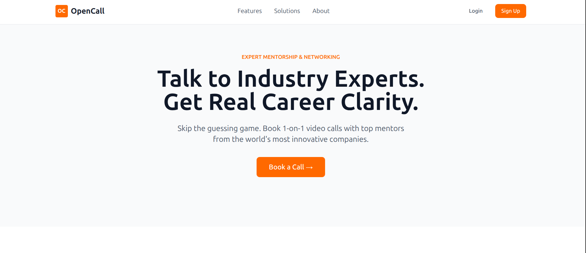

<p align="center">  </p> <h2 align="center">OpenCall</h2> <p align="center"> <strong>Lightweight marketplace for booking short, paid calls with industry experts</strong> </p> <p align="center"> <em>A Topmate-style platform focused on fast discovery, simple scheduling, and a modern developer-first stack.</em> </p
OpenCall is a lightweight marketplace for booking short, paid calls with experts — a Topmate alternative focused on fast discovery, simple scheduling, and a modern developer-first stack.


**Quick pitch:** discover mentors, book a call, and pay with integrated payments. Built with a Go backend (Gin), PostgreSQL, and a Next.js frontend.
---
---
<p align="center">
  
</p>

## Project overview

OpenCall is designed to make it trivial for experts to list short consultation sessions and for users to find and book those sessions. It includes:
- User registration and profiles
- Mentor profiles and availability calendar
- Booking flow with payment (Razorpay integration)
- Token-based authentication (JWT + refresh tokens)
- Minimal admin/mentor tooling for sessions and payouts

This repository contains both the backend API (Go) and the frontend app (Next.js + React + TypeScript).

---

## Tech stack

- Backend: Go (Gin) — REST API, services, repositories
- Database: PostgreSQL
- Auth: JWT access tokens + rotating refresh tokens
- Payments: Razorpay (server-side integration)
- Frontend: Next.js 16 (App Router), React 19, TypeScript, Tailwind CSS
- Session Calling: Zego SDK integration
- State: Zustand for client auth
- Dev tooling: Docker Compose for local DB + optional services

---

## Architecture (high level)

Client (Next.js) ↔ API (Go/Gin) ↔ PostgreSQL

Optional services:
- Razorpay (payments)
- Zego (real-time features)

Simple ASCII diagram:
```bash
Client (browser)
  └─ Next.js (app) — calls → /api/* endpoints
      └─ api client handles JWT refresh and storage
API Server (Go/Gin)
  ├─ Auth service (login, refresh, logout)
  ├─ User & Mentor services
  └─ Payment webhook handlers (Razorpay)
Database (Postgres)
```


Prerequisites:
- Go 1.20+ (or your project Go version)
- Node.js 18+ and npm / pnpm
- Docker & Docker Compose (recommended for Postgres)

1) Start Postgres (recommended via Docker Compose):

```bash
docker compose up -d postgres
```

2) Backend (run from repo root)

Set required environment variables (see below) and run:

```bash
# from repo root
go run ./cmd/server
# or build a binary
go build -o opencall-binary ./cmd/server
./opencall-binary
```

3) Frontend (in `web/`)

```bash
cd web
pnpm install   # or npm install
pnpm dev       # or `npm run dev`
# build for production
pnpm build
pnpm start
```

4) Open `http://localhost:3000` (or your frontend port) and use the app.

---

## Environment variables

Backend (important keys found in `internal/constants/constants.go`):
```bash
- ENV — environment name (development/production)
- SERVER_ADDRESS — host:port for the backend (e.g. :8080)
- CORS_ALLOWED_ORIGINS — comma-separated origins for CORS (frontend URL)
- DB_DRIVER — postgres
- DB_HOST — database host
- DB_PORT — database port
- DB_USER — database user
- DB_PASSWORD — database password
- DB_NAME — database name
- JWT_SECRET — secret used to sign access tokens
- RAZORPAY_KEY_ID — Razorpay key id for payments
- RAZORPAY_KEY_SECRET — Razorpay key secret
- RAZORPAY_WEBHOOK_SECRET — webhook secret for verifying Razorpay payloads
- ZEGO_APP_ID
- ZEGO_SERVER_SECRET — Zego real-time services
```
Frontend (in `web/.env*`):
```bash
NEXT_PUBLIC_API_URL=http://localhost:8080
NEXT_PUBLIC_RAZORPAY_KEY_ID=
NEXT_PUBLIC_API_BASE_URL=http://localhost:8080
NEXT_PUBLIC_ZEGO_APP_ID=
NEXT_PUBLIC_ZEGO_SERVER_SECRET=
```


